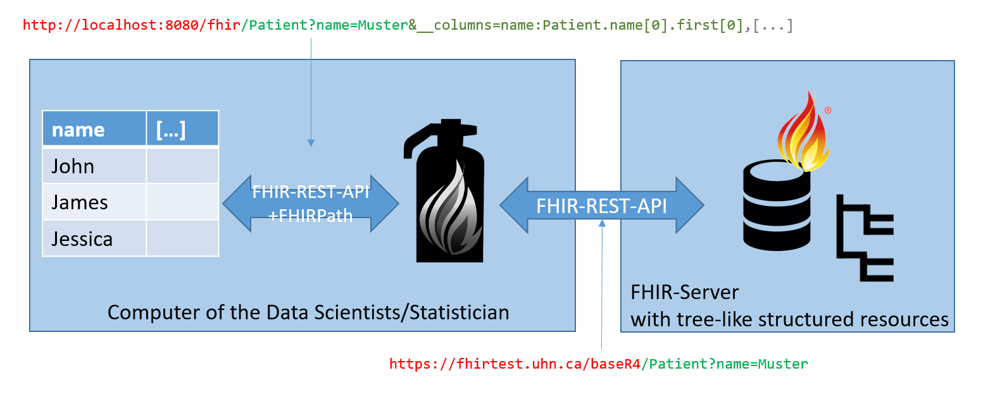
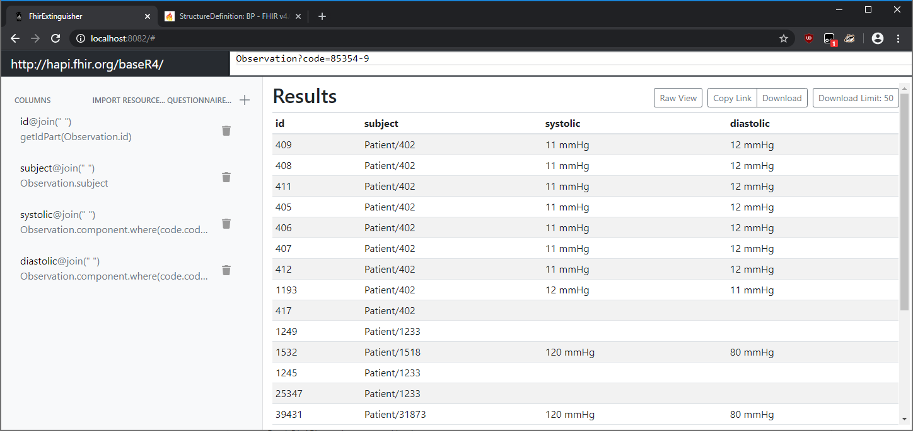

# FhirExtinguisher
This project's goal is to simplify data analysis on HL7 FHIR by easing conversion 
of the hierarchical structure into a flat list for analysing R DataFrames.

There are alternative ways to do this:
* Using [Cerner Bunsen](https://github.com/cerner/bunsen), you can load FHIR resources as DataFrames in Spark and query them using Spark-SQL.
 The main advantage is that you can use the full set of SQL operations like JOIN, etc., but You have to export 
 your entire dataset first.
* Using the [FHIR GraphQL API](http://hl7.org/fhir/graphql.html), you can use operators like "@flatten" to transform it 
into a flatter format. But the result is still a JSON, and the GraphQL API must be supported by the server.  

## How does this work?
This project is a simple WebServer, that connects to a FHIR server and forwards the requests.
This way you can use all the FHIR REST API filtering options provided by the server. For each resource in the resulting bundle, 
a [FHIRPath](http://hl7.org/fhirpath/) expression is evaluated.

All parameters are forwarded as they are, except: 
* `__columns` Must be `name:expression,name2:expression2`. Name might be followed by options like `@join(" ")` and `@explode`, 
which control how to handle multiple returned results by the FHIRPath expression. `@join` concats the strings into a single cell with a delimiter of your choice,
while explode will create multiple rows for the element.
* `__limit` FhirExtinguisher **automatically fetches Bundle pages until limit is met**. This way you can limit the 
number of resources processed.
* `__csvFormat` Is not implemented yet. Change the output format.

The returned bundles are taken and evaluated against multiple FHIR path expressions using the HAPI FHIRPath engine.

Please escape `@join(", ")` as `@join("%2C ")`and `@join(":")` as `@join("%3A")`!

## Building
Requirements: **Java 8, npm 6.13.x**

Use `./gradlew shadowJar` to compile the project. The resulting .jar file will be in `/build/libs/`.

At the first time, to compile the frontend, you have to run `npm install` (and eventually `npm install --only=dev`) in the 
`/frontend` folder, since the gradle build script will only invoke webpack and copy the files into the .jar file. 

If you get `Process 'command 'cmd'' finished with non-zero exit value 2`, please execute `"node_modules/.bin/webpack"` for the 
webpack error message.

#### Frontend Development
You can execute `"node_modules/.bin/webpack-dev-server"` to start an automatically updating version of the frontend. Note 
that the backend will not be executed, so there will not be actual function, but for CSS/Vue.js development this is quite nice.

## Running 
Requirements: **Java 8**, GUI tested with **Firefox** and **Chrome**

Use `java -jar FhirExtinguisher-<version>-all.jar -f http://hapi.fhir.org/baseR4 -p 8080` to start the server on port 8080
on your local machine and connect to the public FHIR R4 server. 

By default, FhirExtinguisher assumes, the server is FHIR R4. If you want to connect with a (D)STU3 server, please add `-v stu3` to the command line arguments.

Available command line options:
* `-f [url]` FHIR server URL
* `-v ["r4"|"stu3"]` FHIR version of the server 
* `-a [username]:[password]` Basic authentication credentials, if required by FHIR server
* `-p [portnumber]` Port number on local machine to open, e.g. with `-p 8080`, the GUI will be available at `http://localhost:8080/`
* `-ext` Allow connections of non-localhost machines

To stop the FhirExtinguisher, press <kbd>Enter</kbd> in the command line window!
### Usage by URL
You can create your own links using the specifications above. In R, you can use 
`data <- read.csv('http://localhost:8082/fhir/Patient?__limit=50&__columns=id@join(" "):Patient.id')` to always 
start with a fresh version from the server. However, the FhirExtinguisher must be running during execution of the script. 

You can create a link using the GUI and copy it into your R script.

### Graphical User Interface
You can use the GUI, which will be available under `http://localhost:[portnumber]/`, to download/export a CSV.
There, you can enter your query in the editor on the top using the [FHIR Search API](https://www.hl7.org/fhir/search.html) 
and add the columns in the sidebar on the left. 

Note that the table shown in the GUI **is only a preview based on the first Bundle returned by the server**. Note also, that the *Import Resource...* 
function is providing suggestions based on the Resource's StructureDefinintion, there is **no guarantee of completeness**.
Array fields are inserted like single elements, so there might be unintended behaviour.

In the searchbar, you can use <kbd>Ctrl</kbd>+<kbd>Enter</kbd> for autocompletion. This is based on the server conformance 
statement on HAPI FHIR using FHIR R4. Note that actual query options on your server might differ.

# Useful FHIRPath expressions
* `.type().name` Get the name of the type, e.g. `Patient.deceased.type().name` is either `dateTime` or `boolean`
* `.resolve()` resolves a reference to another resource.

Custom functions:
* `getIdPart()` circumvents some inconveniences with HAPI FHIR's `IdType` class
* `getChildFields()` returns a list of possible field names, but the expression until this point must return at least one element
* `stringify()` returns a recursive serialization of all the element's fields  

# Authors
* **Johannes Oehm** | (+49) 251/83-5 82 47 | johannes.oehm@uni-muenster.de

# License
TODO

# Acknowledgement
Supported by BMBF grant No. 01ZZ1802V (HiGHmed/Münster) 
